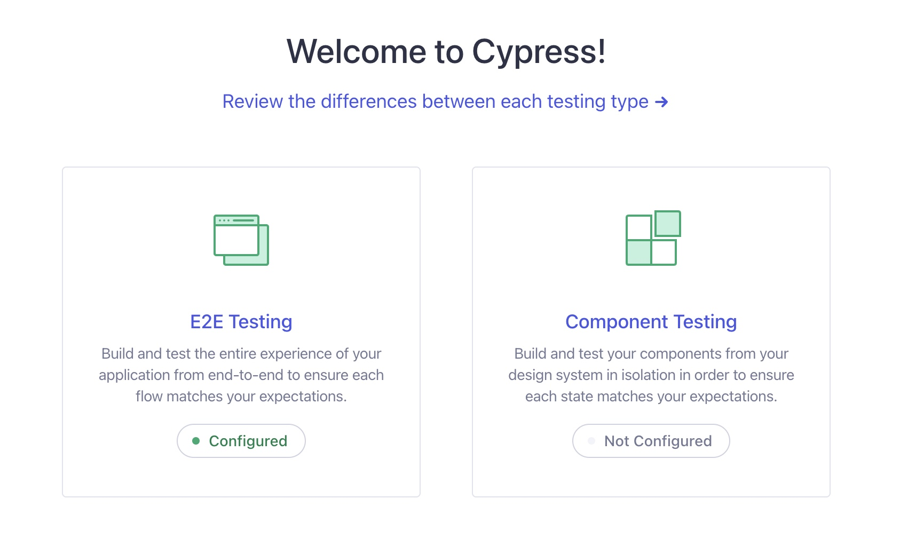
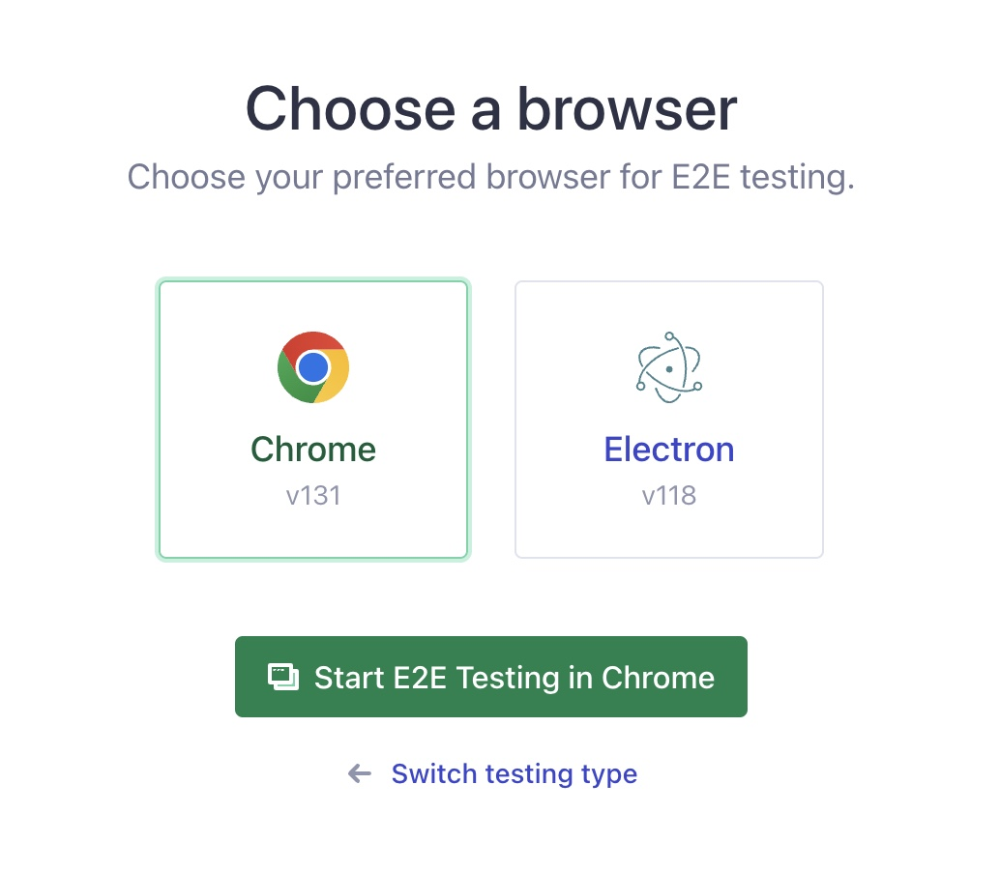

# SightSee 🌍

## Table of Contents

1. [SightSee](#sightsee)
2. [Developer Information](#developer-information)
3. [Choices](#choices)
4. [Technologies](#technologies)
5. [Testing](#testing)
6. [How To Run](#how-to-run)
7. [How To Test](#how-to-test)

## SightSee

SightSee is an application designed to enhance the travel experience by providing users with detailed information about various tourist attractions. Here you can browse through attractions, sort by categories, read and write reviews, and save your favorite destinations. The application aims to make sightseeing more enjoyable and informative by leveraging modern web technologies.

### The application and its different pages are explained in the following walkthrough

#### LandingPage

The first page the user is met by after opening the application. It features a carousel showcasing popular destinations and a section for discovering new places.

#### BrowsePage

The main page where a variety of tourist attractions are displayed. It is possible to filter on different categories and countries, and sort by name or rating. By clicking on a BrowseCard the user can see more detailes about the attraction and from there navigate to the DestinationPage of the clicked attraction.

#### DestinationPage

This page provides detailed information about a specific tourist attraction, including user reviews. Logged-in users can also write reviews and save the destination to their favorites.

### Planner

The planner page gives the user the ability to plan a trip. Here you can drag and drop activities from any country to a timeline.

#### LoginPage

The page where users can log in to their accounts. If the user does not have an account, they can register to create one.

#### My Account

When logged in, users can click on their profile picture to access their profile page. Here, they can view their reviews and saved destinations. The settings page is also available, allowing users to view and manage their personal information.

## Developer Information

**Developed by:**

- Aurora Nergaard
- Lotte Kvalheim
- Mads Bårnes
- Sara Seeberg-Rommetvet

## Choices

### Choice of data

We have filled our database with data from various sources on tourist attractions. This includes information such as attraction names, descriptions, and images. Additionally, we generated users and some reviews with ratings for each attraction. Since this data was partly randomized, there may be some inconsistencies between review text and rating (e.g., a high review with a negative comment), but they do not impack the core functionality of the application.

### Choices related to search, filtering and sorting

We implemented comprehensive search, filtering, and sorting functionalities to enhance user experience. Users can search for destinations by text similarity, filter results by categories and countries, and sort them by various criteria such as rating and alphabetical order. These features ensures that users can easily find and organize the information they need, making the application more user-friendly and efficient.

### Choices related to sustainability

We have made several design choices to ensure the sustainability of our application:

#### Efficient data transfer

We minimize data transfer by optimizing our API calls and using pagination for large datasets. This reduces the amount of data sent over the network, conserving bandwidth and reducing energy consumption.

#### Debounce

We implemented a debounce functionality in our search bar in order to improve both performance and sustainability. By delaying the API calls until the user has paused typing, we are able to minimize unnecessary requests, which reduces the server load.

#### Lazy loading

We implemented lazy loading for images and other media content. This means that images are only loaded when they are about to enter the viewport, reducing unnecessary data transfer.

#### Color choices

Our color palette is designed to be visually appealing and energy-efficient, particulary for devices with OLED screens where darker colors consume less power. We also support dark mode to further reduce energy consumption on such devices.

### Choices related to accessibility

To ensure our application is accessible to all users, we have implemented several key measures. First, we incorporated ARIA labels to enhance screen reader support, helping users with visual impairments navigate the application more effectively. Our color palette was designed with inclusivity in mind, optimized for users with various types of color blindness, ensuring all visual elements remain clear and visible—validated by our Lighthouse tests. Additionally, we prioritized keyboard navigation, making all interactive elements accessible through tabbing. After feedback from peer reviews, we implemented functionality to gray out buttons and dropdowns when no options are available, enhancing usability.

### Choices related to responsive design

We have prioritized responsive design to ensure a seamless experience across devices and screen sizes. By leveraging CSS Grid and Flexbox, our layout adapt dynamically to different screens, while media queries finetune styles like font sizes and margins for optimal readability. Responsive images adjust to device resolution, enhancing load times and visual quality.

### Choices related to global state management

The planner page uses apollo state management to maintain a single source of truth, ensuring consistency and seamless interaction across components. This approach simplifies data flow, reduces unnecessary re-renders, and improves scalability by allowing components to access shared data directly. It enhances performance and makes the planner page more intuitive and responsive for users.

### Choices related to reproducible code

To ensure others can easily understand and run the project as intended, we have focused on creating reproducible and well-documented code. This README provides detailed information about the application, including instructions for installation and running, testing procedures, and overview of the technology stack, and explanations of key design choices. Throughout the codebase, we have added descriptive comments to clairify their purpose and functionality.

## Technologies

### Frontend

**React with TypeScript:** React enables dynamic, component-based interfaces that are efficient and scalable. TypeScript adds type safety, which reduces bugs and improves reliability in the code.

**shadcn:** This UI component library provides a cohesive and visually appealing interface across the app, maintaining a consistent design language throughout.

### Backend

**Apollo Server and GraphQL:**
Apollo Server with GraphQL enables efficient data fetching, allowing only necessary data to be requested. This minimizes load times and reduces bandwidth usage, improving app performance.

**PostgreSQL:**
PostgreSQL is used as the relational database for managing structured data and handling complex queries. It stores essential information such as user reviews and destination details.

## Testing

### End-to-End Testing

We use **Cypress** for end-to-end testing to validate key features such as search, filtering, and navigation. Cypress simulates user interactions, ensuring the application behaves as expected across various scenarios.

### Component Testing

**Vitest** is utilized for testing individual components, ensuring their functionality and integration within the application.

### Code Structure and Type Safety

To maintain clean and well-structured code, we use **Prettier** for formatting and **ESLint** for enforcing type safety and coding standards.

## How To Run

To run the application in development mode, follow these steps:

1. **Clone the repository**:

   ```bash
   # SSH
   git clone git@git.ntnu.no:IT2810-H24/T33-Project-2.git

   # HTTPS
   git clone https://git.ntnu.no/IT2810-H24/T33-Project-2.git

   cd T33-Project-2
   ```

2. **Install dependencies**:

   ```bash
   npm i
   ```

3. **Start the backend development server**:

   ```bash
   npm run dev:backend
   ```

   Runs on [localhost:3001/graphql](localhost:3001/graphql)

4. **Open a `new terminal` and start the frontend development server**:

   ```bash
   npm run dev:frontend
   ```

5. **Open your browser** and navigate to [http://localhost:3000](http://localhost:3000) to see the application running.

Make sure you have [Node.js](https://nodejs.org/) and [npm](https://www.npmjs.com/) installed on your machine.

## How To Test

### End to end tests

To run the tests in development mode, follow these steps:

1. **Open a `terminal` and run the e2e test**:

   ```bash
   npm run cypress:open
   ```

   The e2e test is using our VM url, so there is no need to run the frontend or the backend localy.

2. Pick the E2E option on the right side

   

3. Click Chrome option

   

4. Pick the `routing.cy.ts` option to start the e2e test

   

### Components tests

Open a terminal and navigate to the frontend file:

```bash
    cd frontend
```

Then run the tests from there:

```bash
    npm run test
```
